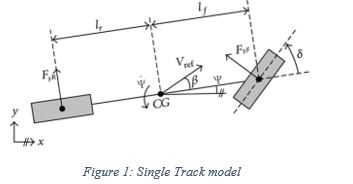
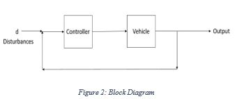
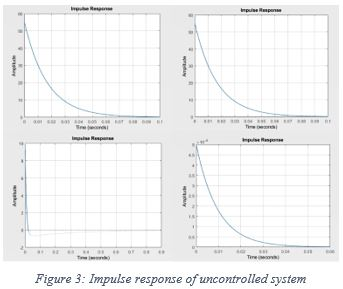
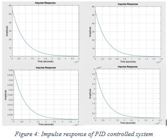
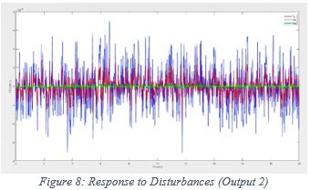

# Controller-Design---PID-H_2-and-H_infinity
Lateral Control of Autonomous Vehicles. Designed PID, 𝐻2 and 𝐻∞ controllers and trade offs in design were studied upon for real-time implementation.

## VEHICLE LATERAL DYNAMICS MODEL
In the analysis, kinematic model is used for lateral control of vehicle dynamics. For simplifying the analysis, the vehicle motion is assumed to be planar. For the purpose of neglecting the load transfer during the vehicle motion, the direction of center of gravity is taken as along the one projected into the paper. By the planar assumptions, we require one rotation and one translation for state estimation of the vehicle. The co-ordinate system used for the analysis is shown in figure 1. The x-axis of the vehicle points in the front of the vehicle, the y-axis towards the right hand side from the perspective of the driver and z-axis by right hand rule points towards the ground.

## PID CONTROLLER DESIGN
The controller design using PID is a relatively extreme form of a phase lead-lag compensator design having one of the poles at origin and the other pole tending to infinity. The PI and the PD controller designs similar to PID are extreme cases of phase-lag and phase-lead compensators, respectively.

## H_2 controller design
The H_2 controller is designed to minimize the H_2norm of the system.  For designing the H_2 controller, the Algebraic Ricatti equation was solved. Because of separation principle, dynamics for both the controller and the observer were obtained separately. 

## H_∞ Controller design
The H_∞ controller is designed to minimize the H_∞  norm of the system. For the design of H_∞ controller, the H_2 problem was continued by taking the H_∞ norm of the H_2 controlled system as the upper bound for the bisection method in the controller design. Again because of the separation principle, dynamics for both the controller and the observer were obtained separately.

## Attenuation to disturbances
The responses to disturbances of the PID, H_2 and H_∞controlled system is been studied to compare the robustness of the controller designs. Figure 7 and 8 shows output 1 and 2 of the response to the disturbances. The blue lines are PID control, the red lines are of H_2control and the green line are of the H_∞controlled system. H_2 and H_∞controlled system attenuate the disturbances much better than PID and thus are way more robust as compared to PID controlled system. For output 1, H_2 controller performs the best, while for output 2, H_∞ attenuates the disturbances better than the other two control designs

## Comparison of PID,  H_2 and H_∞ controller design
Without disturbances, PID gave slightly better performance as compared to H_2 and H_∞ controller. In attenuation of disturbances H_2 and H_∞ controller designs were much more robust than PID control as expected. 

## Conclusions 
For real-time control implementation in an embedded system environment where computational power is very limited and when our tolerance to disturbance attenuation is high, then PID control is preferable over H_2 and H_∞control. In other cases when, robust control is essential and computational power is not very limited, H_2 and H_∞control is preferable over PID control. 

